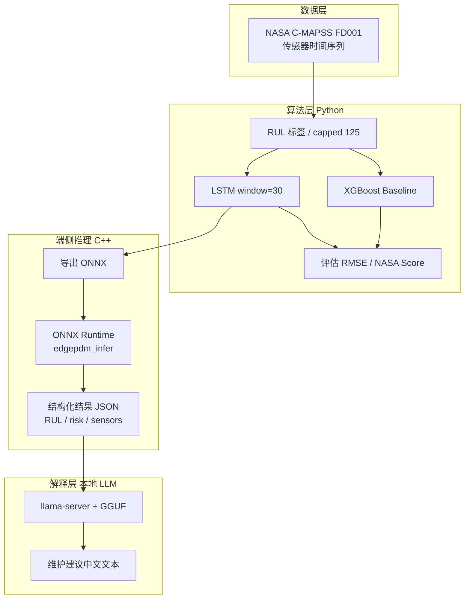

# EdgePdM-Agent 架构图

```mermaid
flowchart TB
  subgraph Data["数据层"]
    A[NASA C-MAPSS FD001<br/>传感器时间序列]
  end

  subgraph Train["算法层 Python"]
    B[RUL 标签 / capped 125]
    C[XGBoost Baseline]
    D[LSTM window=30]
    E[评估 RMSE / NASA Score]
  end

  subgraph Edge["端侧推理 C++"]
    F[导出 ONNX]
    G[ONNX Runtime<br/>edgepdm_infer]
    H[结构化结果 JSON<br/>RUL / risk / sensors]
  end

  subgraph Explain["解释层 本地 LLM"]
    I[llama-server + GGUF]
    J[维护建议中文文本]
  end

  A --> B --> C
  B --> D
  C --> E
  D --> E
  D --> F --> G --> H --> I --> J
```

## 模块边界

| 模块 | 负责 | 不负责 |
|------|------|--------|
| LSTM/XGBoost | 预测 RUL | 写维修话术 |
| C++ ORT | 低延迟推理 | 训练 |
| llama.cpp | 解释 JSON | 预测 RUL / 查手册 RAG |
